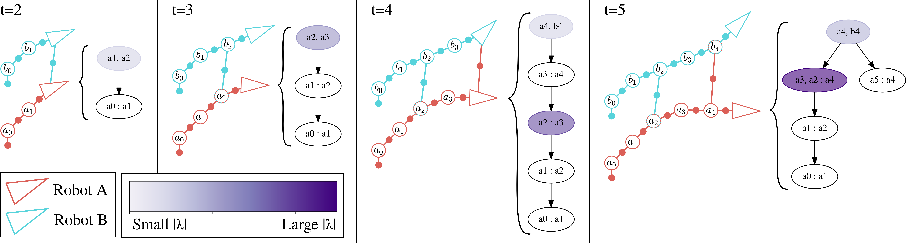

# Incremental Manifold Edge-based Separable ADMM (iMESA)
 [](https://opensource.org/licenses/MIT)  &nbsp;[](https://rpl.ri.cmu.edu/)

<p align="center">

Overview of the iMESA algorithm operating on a toy dataset
</p>


iMESA is an incremental distributed back-end algorithm for Collaborative Simultaneous Localization and Mapping (C-SLAM). For real-world deployments, robotic teams require algorithms to compute a consistent state estimate accurately, within online runtime constraints, and with potentially limited communication. In this package we provide the original implementation of "Incremental Manifold Edge-based Separable ADMM" (iMESA) a fully distributed C-SLAM back-end algorithm that can provide a multi-robot team with accurate state estimates in real-time with only sparse pair-wise communication between robots. This algorithm is described in full in our paper "iMESA: Incremental Distributed Optimization for Collaborative Simultaneous Localization and Mapping" which can be accessed on [TODO arXiv Link]. If you use this package please cite our paper as:

```
@inproceedings{mcgann_imesa_2024, 
    title = {{iMESA}: Incremental Distributed Optimization for Collaborative Simultaneous Localization and Mapping},
    author = {D. McGann and M. Kaess},
    fullauthor = {Daniel McGann and Michael Kaess},
    booktitle = {Proc. Robotics: Science and Systems (RSS)},
    year = 2024,
    pages = {n/a}, % will be added soon
    address = {Delft, {NL}}
}
```

Extensive evaluation on real and synthetic data demonstrates that iMESA is able to outperform comparable state-of-the-art C-SLAM back-ends. Below we have an examples of such performance on a long 5 robot dataset, and a shorter 10 robot dataset. In these animations color represents the magnitude of error for individual poses.

<p align="center">

iMESA Compared to prior works on a long 5 robot synthetic dataset
</p>

<p align="center">

iMESA Compared to prior works on a short 10 robot synthetic dataset
</p>


## Documentation
We provide the implementation of iMESA as a simple C++ library. This library provides a class `IMESAAgent` that can be used on-board each robot in a multi-robot team to solve their collaborative state estimate using the iMESA algorithm. Practically, this class is used much like existing incremental SLAM solvers like `ISAM2` as provided by `gtsam`, with extensions to incorporate information from communications with other robots.

See `include/imesa/imesa.h` for inline documentation on this class's interface. Additionally, see our [experiments repository](https://github.com/rpl-cmu/imesa-experiments) for an example of how this library can be used. The best place for documentation on the algorithm itself is the paper discussed above!

We additionally provide a more generic interface (`IncrementalSAMAgent`) that can be inherited from, to implement other incremental C-SLAM solvers that use the same 2-stage communication procedure. See our implementation of DDF-SAM2 in our [experiments repository](https://github.com/rpl-cmu/imesa-experiments) for an example of how to write a custom algorithm using this interface.

Note: This library also provides functionality to handle global variables that are variables in the SLAM optimization that do not necessarily belong to any singular robot (i.e. landmarks). Such variables are marked with a `#` character in their variable key. Handling these variables requires some additional information to be shared during communication (keys of global vars). This functionality was not explicitly discussed in the paper above, but has been tested and users are safe to use this functionality!

## Dependencies
The only dependency for iMESA is [GTSAM](https://github.com/borglab/gtsam). iMESA should not be sensitive to GTSAM version, but has only been tested with `gtsam 4.2a8`. See the GTSAM github page for installation instructions.

## Installation Instructions

As this package is only a library it is most frequently will be used as a 3rd party dependency within your project. We encourage users to use `FetchContext` to access and make the iMESA library available within their own project. 

You can include iMESA as a dependency in your project by adding the following to your `CMakeLists.txt` file:

```
include(FetchContent)
FetchContent_Declare(
  imesa
  GIT_REPOSITORY  https://github.com/rpl-cmu/imesa.git 
  GIT_TAG         main
)
FetchContent_MakeAvailable(imesa)
```

An example of this, in practice, can be found in the [experiments repository](https://github.com/rpl-cmu/imesa-experiments).

# Issues
If you encounter issues with this library please fill out a bug report on github with details on how to reproduce the error!